# ECS 严格 Buffer 提交流程图（提案）

> 目标：彻底杜绝“CPU 已写但 GPU 未上传/上传时序错位”问题。
> 
> 统一规则：所有涉及 CPU→GPU Buffer 更新的 System 必须严格落在固定 ExecutionPhase，禁止跨阶段做隐式提交。

## 1) 阶段定义（目标顺序）

1. RenderCollectComponent：收集 Component
2. RenderCpuBuild：CPU 端生成/更新数据（顶点、索引、实例、命令等）
3. RenderCull：裁剪
4. RenderClassify：分类/排序/分桶/批处理
5. RenderCpuBufferFlush：CPU 端 BufferFlush（把脏区登记到 BufferUpdateQueue）
6. RenderBeginPass：BeginRenderPass 前准备
7. RenderGpuCopyInPass：BeginRenderPass 后执行 vkCmdCopyBuffer
8. RenderDrawSubmit：绘制提交
9. RenderDebug/RenderStat：调试与统计
10. RenderSubmit：Present/提交

## 2) 文件流程图（Mermaid）

```mermaid
flowchart TD
    A[Context::Render / RenderGraph] --> B[Phase 1: RenderCollectComponent]
    B --> B1[Collect Systems\n- PrimitiveCollect\n- TextCollect\n- LineCollect]

    B1 --> C[Phase 2: RenderCpuBuild]
    C --> C1[CPU Build Systems\n- TextBuild\n- PrimitiveBatchBuild\n- 其它CPU生成]

    C1 --> D[Phase 3: RenderCull]
    D --> D1[Cull Systems\n- PrimitiveCull\n- 视锥/HZB等]

    D1 --> E[Phase 4: RenderClassify]
    E --> E1[Classify/Sort/BatchFinalize\n- PrimitiveSort\n- PrimitiveBatchFinalize\n- Material/Pass分桶]

    E1 --> F[Phase 5: RenderCpuBufferFlush]
    F --> F1[Buffer Flush Systems\n- LineBufferPrepare\n- TextResourceSync\n- 所有BufferAccessor::Commit]
    F1 --> F2[DeviceBuffer::Flush/Unmap\n=> StagedBuffer::MarkDirty\n=> BufferUpdateQueue::AddUpdate]

    F2 --> G[Phase 6: RenderBeginPass]
    G --> G1[RenderSystemCore::BeginRenderPass]

    G1 --> H[Phase 7: RenderGpuCopyInPass]
    H --> H1[RenderBufferUploadSystem\nBufferUpdateQueue::FlushAll]
    H1 --> H2[vkCmdCopyBuffer + PipelineBarrier]

    H2 --> I[Phase 8: RenderDrawSubmit]
    I --> I1[RenderPrimitiveSubmit / TextRenderSubmit / LineRender]

    I1 --> J[Phase 9: RenderDebug / RenderStat]
    J --> K[Phase 10: RenderSubmit]
    K --> K1[SwapchainSubmitSystem]
```

## 3) 文件归属建议（按阶段）

- RenderCollectComponent
  - src/ecs/systems/render/RenderPrimitiveCollectSystem.cpp
  - src/ecs/systems/render/TextCollectSystem.cpp
  - src/ecs/systems/render/LineCollectSystem.cpp
- RenderCpuBuild
  - src/ecs/systems/render/TextBuildSystem.cpp
  - src/ecs/systems/render/RenderPrimitiveBatchBuildSystem.cpp
- RenderCull
  - src/ecs/systems/render/RenderPrimitiveCullSystem.cpp
- RenderClassify
  - src/ecs/systems/render/RenderPrimitiveSortSystem.cpp
  - src/ecs/systems/render/RenderPrimitiveBatchFinalizeSystem.cpp
- RenderCpuBufferFlush
  - src/ecs/systems/render/LineBufferPrepareSystem.cpp
  - src/ecs/systems/render/TextResourceSyncSystem.cpp
  - 以及所有调用 BufferAccessor::Commit / DeviceBuffer::Flush 的系统
- RenderGpuCopyInPass
  - src/ecs/systems/render/RenderBufferUploadSystem.cpp
  - src/Vulkan/VKBufferUpdateQueue.cpp
  - src/Vulkan/VKStagedBuffer.cpp
- RenderDrawSubmit
  - src/ecs/systems/render/RenderPrimitiveSubmitSystem.cpp
  - src/ecs/systems/render/TextRenderSubmitSystem.cpp
  - src/ecs/systems/render/LineRenderSystem.cpp

## 4) 严格约束（必须遵守）

1. Draw 阶段禁止再调用 Commit/Flush。
2. Commit/Flush 只能发生在 RenderCpuBufferFlush。
3. vkCmdCopyBuffer 只能发生在 RenderGpuCopyInPass。
4. RenderDrawSubmit 只允许绑定并绘制，不允许修改 CPU staging 数据。
5. RenderDebug/RenderStat 不得改变 Buffer dirty 状态。

## 5) 关键说明

- 这份图是重构目标态流程，不是当前实现现状。
- 若你确认此图，我下一步会按此流程改 ExecutionPhase 枚举与所有相关 System 的 SetExecutionOrder，并加静态/运行时校验防止越阶段写入。
