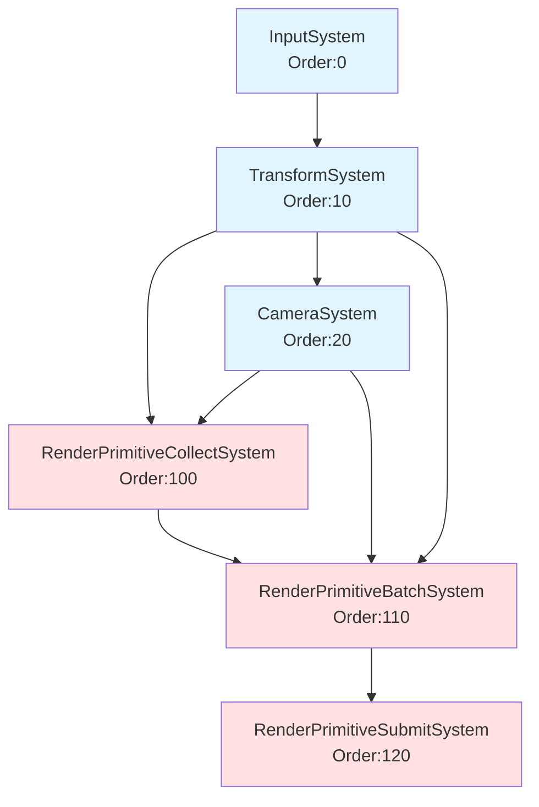

# ECS System 依赖声明使用指南

**更新日期**: 2026年2月9日  
**版本**: 1.0

## 概述

System 依赖关系现已内置到类定义中，无需在注册时手动设置。每个 System 在构造函数中声明自己的类型、执行顺序和依赖关系，ECSContext 会自动处理。

---

## 核心机制

### 1. SystemType 枚举

在 `System.h` 中定义了所有 System 类型：

```cpp
enum class SystemType
{
    Unknown,
    Input,
    Transform,
    Camera,
    BoundingBox,
    RenderCollect,
    RenderBatch,
    RenderSubmit,
    Physics,
    Animation,
    // 根据需要添加更多...
};
```

### 2. System 基类新增成员

```cpp
class System : public Object
{
protected:
    SystemType systemType = SystemType::Unknown;
    int executionOrder = 0; // 数值越小越先执行
    std::vector<std::type_index> dependencies; // 依赖的 System 类型

protected:
    // 设置 System 类型（在派生类构造函数中调用）
    void SetSystemType(SystemType type);
    
    // 设置执行顺序（在派生类构造函数中调用，数值越小越先执行）
    void SetExecutionOrder(int order);
    
    // 添加对另一个 System 类型的依赖
    template<typename T>
    void AddDependency();

public:
    // 所有依赖就绪后调用
    virtual void OnDependenciesReady() {}
};
```

---

## 使用方法

### 步骤 1: 在构造函数中声明依赖

在每个 System 的构造函数中：

1. 调用 `SetSystemType()` 设置系统类型
2. 调用 `SetExecutionOrder()` 设置执行优先级
3. 使用 `AddDependency<T>()` 声明依赖的 System

**示例：CameraSystem**

```cpp
// CameraSystem.cpp
CameraSystem::CameraSystem(ECSContext* ctx)
    : context(ctx)
    , input_system(nullptr)
{
    // 设置系统类型和属性
    SetSystemType(SystemType::Camera);
    SetExecutionOrder(20);  // 在 Transform 之后运行
    
    // 声明依赖
    AddDependency<InputSystem>();     // 需要输入用于相机控制
    AddDependency<TransformSystem>(); // 需要先更新 Transform
}
```

### 步骤 2: 注册 System（无需手动设置依赖）

```cpp
// 旧方式（不推荐）：需要手动设置依赖
auto cameraSystem = context->RegisterTickSystem<CameraSystem>(context);
context->AddTickDependency<CameraSystem, InputSystem>();
context->AddTickDependency<CameraSystem, TransformSystem>();

// 新方式（推荐）：依赖自动处理
auto cameraSystem = context->RegisterTickSystem<CameraSystem>(context);
// 依赖关系已经在 CameraSystem 构造函数中声明，无需额外代码！
```

### 步骤 3: （可选）实现 OnDependenciesReady

如果需要在所有依赖就绪后执行特殊初始化：

```cpp
// CameraSystem.h
class CameraSystem : public System
{
public:
    void OnDependenciesReady() override;
};

// CameraSystem.cpp
void CameraSystem::OnDependenciesReady()
{
    // 此时所有依赖的 System 都已注册并排序完成
    // 可以安全地获取依赖的 System
    if (!input_system && context)
    {
        input_system = context->GetSystem<InputSystem>().get();
    }
}
```

---

## 实际案例

### 案例 1: InputSystem（无依赖）

```cpp
// InputSystem.cpp
InputSystem::InputSystem()
{
    // 设置系统类型和属性
    SetSystemType(SystemType::Input);
    SetExecutionOrder(0);  // 最先运行
    
    // 无依赖 - Input 系统最优先
    
    // 初始化输入状态...
}
```

**执行顺序**: 0（最先）  
**依赖**: 无

---

### 案例 2: TransformSystem（无依赖）

```cpp
// TransformSystem.cpp
TransformSystem::TransformSystem(const std::string& name)
    : System(name)
{
    // 设置系统类型和属性
    SetSystemType(SystemType::Transform);
    SetExecutionOrder(10);  // 在 Input 之后运行
    
    // 无依赖 - Transform 是基础系统
}
```

**执行顺序**: 10  
**依赖**: 无

---

### 案例 3: CameraSystem（依赖 Input 和 Transform）

```cpp
// CameraSystem.cpp
CameraSystem::CameraSystem(ECSContext* ctx)
    : context(ctx)
    , input_system(nullptr)
{
    // 设置系统类型和属性
    SetSystemType(SystemType::Camera);
    SetExecutionOrder(20);  // 在 Transform 之后运行
    
    // 声明依赖
    AddDependency<InputSystem>();     // 需要输入用于相机控制
    AddDependency<TransformSystem>(); // 需要先更新 Transform
}
```

**执行顺序**: 20  
**依赖**: InputSystem, TransformSystem

---

### 案例 4: RenderPrimitiveCollectSystem（渲染管线第一阶段）

```cpp
// RenderPrimitiveCollectSystem.cpp
RenderPrimitiveCollectSystem::RenderPrimitiveCollectSystem(const std::string& name)
    : System(name)
{
    // 设置系统类型和属性
    SetSystemType(SystemType::RenderCollect);
    SetExecutionOrder(100);  // 渲染管线第一阶段
    
    // 声明依赖
    AddDependency<TransformSystem>(); // 需要世界坐标变换
    AddDependency<CameraSystem>();    // 需要相机信息
}
```

**执行顺序**: 100  
**依赖**: TransformSystem, CameraSystem

---

### 案例 5: RenderPrimitiveBatchSystem（渲染管线第二阶段）

```cpp
// RenderPrimitiveBatchSystem.cpp
RenderPrimitiveBatchSystem::RenderPrimitiveBatchSystem(const std::string& name)
    : System(name)
{
    // 设置系统类型和属性
    SetSystemType(SystemType::RenderBatch);
    SetExecutionOrder(110);  // 渲染管线第二阶段
    
    // 声明依赖
    AddDependency<TransformSystem>();            // 需要 Transform 索引
    AddDependency<CameraSystem>();               // 需要相机用于视锥剔除
    AddDependency<RenderPrimitiveCollectSystem>(); // 需要收集的渲染项
}
```

**执行顺序**: 110  
**依赖**: TransformSystem, CameraSystem, RenderPrimitiveCollectSystem

---

### 案例 6: RenderPrimitiveSubmitSystem（渲染管线最后阶段）

```cpp
// RenderPrimitiveSubmitSystem.cpp
RenderPrimitiveSubmitSystem::RenderPrimitiveSubmitSystem(const std::string& name)
    : System(name)
{
    // 设置系统类型和属性
    SetSystemType(SystemType::RenderSubmit);
    SetExecutionOrder(120);  // 渲染管线最后阶段
    
    // 声明依赖
    AddDependency<RenderPrimitiveBatchSystem>(); // 需要批处理后的数据
}
```

**执行顺序**: 120  
**依赖**: RenderPrimitiveBatchSystem

---

## 完整的执行流程图



**蓝色**: 逻辑更新系统（Tick Systems）  
**红色**: 渲染系统（Render Systems）

---

## 自动依赖处理机制

### Context 的自动处理流程

1. **注册时自动提取依赖**  
   `ECSContext::AddOrUpdateSystem()` 会自动调用 `system->GetDependencies()` 并注册所有依赖关系。

2. **拓扑排序**  
   `ECSContext::SortSystemList()` 使用拓扑排序算法，确保：
   - 依赖的 System 总是先执行
   - 相同优先级的 System 按注册顺序执行
   - 检测循环依赖并回退到优先级排序

3. **初始化顺序**  
   在 `ECSContext::Initialize()` 中：
   ```cpp
   SortTickSystems();
   SortRenderSystems();
   
   for (auto& entry : tick_system_order)
   {
       entry.system->OnDependenciesReady(); // 先通知依赖就绪
       entry.system->Initialize();          // 再初始化
   }
   ```

---

## 最佳实践

### ✅ 推荐做法

1. **始终在构造函数中声明依赖**
   ```cpp
   MySystem::MySystem()
   {
       SetSystemType(SystemType::MyType);
       SetExecutionOrder(50);
       AddDependency<RequiredSystem>();
   }
   ```

2. **使用合理的执行顺序值**
   - 0-9: 输入系统
   - 10-19: 基础逻辑系统（Transform, Physics 等）
   - 20-49: 高级逻辑系统（Camera, AI 等）
   - 100-199: 渲染系统

3. **只依赖必要的 System**  
   避免不必要的依赖，保持系统解耦。

4. **在 OnDependenciesReady 中获取依赖引用**
   ```cpp
   void MySystem::OnDependenciesReady()
   {
       if (context)
           transformSystem = context->GetSystem<TransformSystem>();
   }
   ```

### ❌ 避免的做法

1. **不要创建循环依赖**
   ```cpp
   // 错误示例
   SystemA::SystemA() { AddDependency<SystemB>(); }
   SystemB::SystemB() { AddDependency<SystemA>(); } // 循环依赖！
   ```

2. **不要在注册后手动添加依赖**
   ```cpp
   // 不推荐 - 应在构造函数中声明
   auto system = context->RegisterSystem<MySystem>();
   context->AddTickDependency<MySystem, OtherSystem>();
   ```

3. **不要忘记设置 SystemType**
   ```cpp
   // 错误 - 忘记设置类型
   MySystem::MySystem() {
       SetExecutionOrder(50); // 只设置了顺序
       // 缺少: SetSystemType(SystemType::MyType);
   }
   ```

---

## 调试技巧

### 1. 查看 System 执行顺序

在 `ECSContext::Initialize()` 后打印：

```cpp
void ECSContext::PrintSystemOrder()
{
    std::cout << "=== Tick Systems ===" << std::endl;
    for (const auto& entry : tick_system_order)
    {
        if (entry.system)
        {
            std::cout << "Priority: " << entry.priority 
                      << " | " << entry.system->GetName() << std::endl;
        }
    }
    
    std::cout << "=== Render Systems ===" << std::endl;
    for (const auto& entry : render_system_order)
    {
        if (entry.system)
        {
            std::cout << "Priority: " << entry.priority 
                      << " | " << entry.system->GetName() << std::endl;
        }
    }
}
```

### 2. 检测循环依赖

在 `SortSystemList()` 中会自动检测并输出警告：

```
[ECSContext::SortSystemList] WARNING: Tick system dependencies contain a cycle. 
Falling back to priority order.
```

### 3. 验证依赖是否满足

```cpp
void MySystem::OnDependenciesReady()
{
    auto dep = context->GetSystem<RequiredSystem>();
    if (!dep)
    {
        std::cerr << "[MySystem] ERROR: Required dependency not found!" << std::endl;
    }
}
```

---

## 迁移指南

### 从旧方式迁移到新方式

**旧代码（手动依赖管理）：**

```cpp
// 注册系统
auto inputSystem = context->RegisterTickSystem<InputSystem>();
auto transformSystem = context->RegisterTickSystem<TransformSystem>();
auto cameraSystem = context->RegisterTickSystem<CameraSystem>(context);

// 手动设置依赖
context->AddTickDependency<TransformSystem, InputSystem>();
context->AddTickDependency<CameraSystem, InputSystem>();
context->AddTickDependency<CameraSystem, TransformSystem>();

// 手动设置优先级
context->SetSystemPriority<InputSystem>(0);
context->SetSystemPriority<TransformSystem>(10);
context->SetSystemPriority<CameraSystem>(20);
```

**新代码（自动依赖管理）：**

```cpp
// 只需注册系统，依赖和优先级已在构造函数中声明
auto inputSystem = context->RegisterTickSystem<InputSystem>();
auto transformSystem = context->RegisterTickSystem<TransformSystem>();
auto cameraSystem = context->RegisterTickSystem<CameraSystem>(context);

// 无需额外代码！依赖关系自动处理
```

### 修改现有 System

1. **在 System.h 中添加系统类型枚举（如果需要）**
2. **修改 System 构造函数**
3. **测试运行顺序是否正确**

---

## FAQ

### Q: 如果忘记声明依赖会怎样？

A: System 仍会执行，但可能在依赖的数据尚未准备好时运行，导致错误或未定义行为。建议在 `OnDependenciesReady()` 中验证依赖是否存在。

### Q: 可以动态添加依赖吗？

A: 不推荐。依赖应在构造函数中静态声明。如果确实需要动态依赖，可以手动调用 `context->AddTickDependency<A, B>()`，但会使代码难以维护。

### Q: ExecutionOrder 和 Priority 有什么区别？

A: 
- `ExecutionOrder`: 在 System 构造函数中设置，表示建议的执行顺序
- `Priority`: 在注册时可选覆盖，用于特殊情况下的调优

### Q: 如何确保 System A 在 B 之后执行？

A: 在 System B 的构造函数中添加 `AddDependency<SystemA>()`，表示 B 依赖于 A，因此 A 会先执行。

---

## 总结

新的依赖声明机制提供了：

✅ **类型安全**: 依赖关系在编译期声明  
✅ **自动管理**: Context 自动处理拓扑排序  
✅ **可维护性**: 依赖关系在类定义中一目了然  
✅ **灵活性**: 支持执行顺序和依赖混合控制  
✅ **调试友好**: 自动检测循环依赖

通过在构造函数中声明依赖，System 的行为更加清晰，代码更易维护和扩展。

---

**相关文档**:
- [ECS组件设计分析与改进建议.md](ECS组件设计分析与改进建议.md)
- [inc/hgl/ecs/System.h](../inc/hgl/ecs/System.h)
- [src/ecs/Context.cpp](../src/ecs/Context.cpp)
