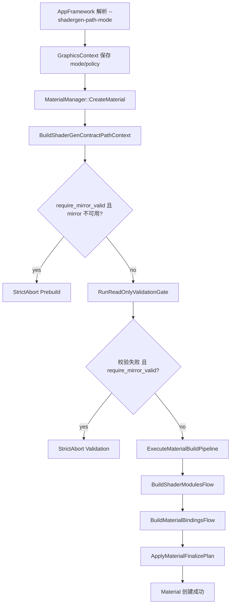
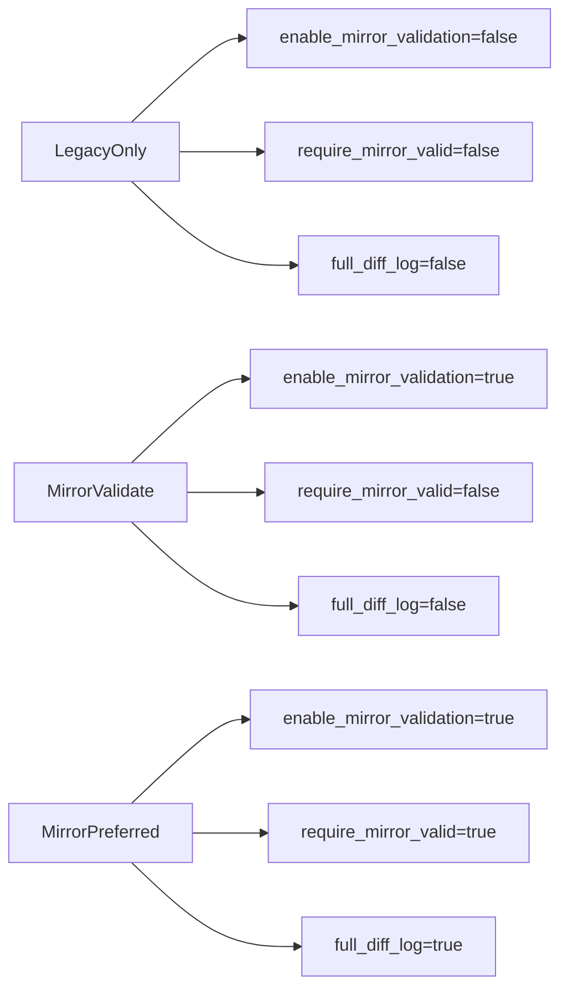
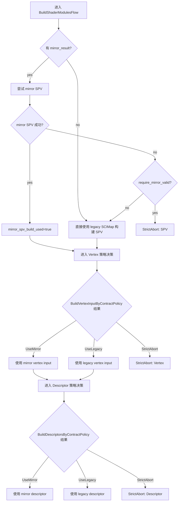
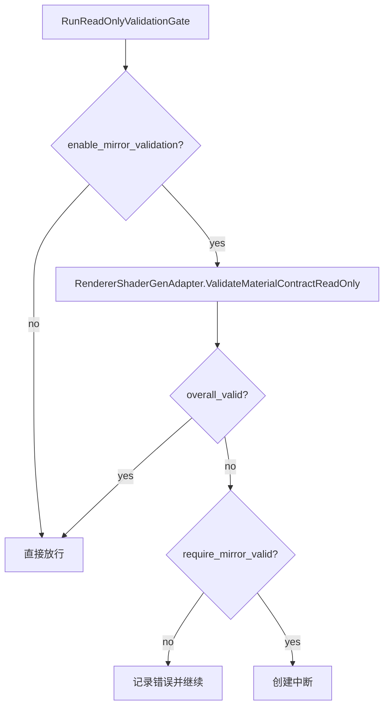
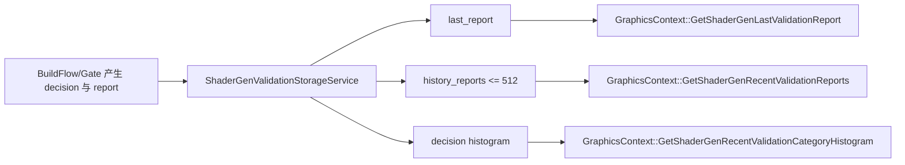

# ShaderGen 适配层技术文档

## 1. 文档目标

本文面向项目维护者，解释 `inc/hgl/graph/module` 与 `src/SceneGraph/module` 中 ShaderGen 适配层的设计目的、运行路径、策略模式（`ShaderGenPathMode`）差异、失败分支与可观测性接口。

这层代码的核心价值不是“再做一套渲染系统”，而是给材质构建链路增加一条可验证、可回退、可强制切换的 contract/mirror 路径。

## 2. 名词定义

- `legacy`：原有材质构建路径（原始 `MaterialCreateInfo` -> shader map -> Vulkan 资源）。
- `mirror`：由 contract builder 从同一输入生成的镜像结果（`mtl::contract::ShaderGenResult`），用于对照验证和可选替代。
- `request`：请求侧结构（`mtl::contract::ShaderGenRequest`），用于 request-result 契约一致性校验。
- `strict gate`：严格门禁。启用后，关键不一致直接中断材质创建。

## 3. 组件分层

### 3.1 策略与上下文层

- 路径模式与策略：`inc/hgl/graph/module/ShaderGenPathMode.h`
- 运行上下文拼装：`inc/hgl/graph/module/ShaderGenContractPathContext.h`
- 运行上下文实现：`src/SceneGraph/module/ShaderGenContractPathContext.cpp`

职责：把 `ShaderGenPathMode` 翻译成 `ShaderGenPathPolicy`，并预构建 `request/mirror`（若策略允许）。

### 3.2 校验与报告层

- 只读校验门：`inc/hgl/graph/module/ShaderGenReadOnlyValidationGate.h`
- 校验门实现：`src/SceneGraph/module/ShaderGenReadOnlyValidationGate.cpp`
- 校验执行器：`inc/hgl/graph/module/RendererShaderGenAdapter.h`
- 校验执行器实现：`src/SceneGraph/module/RendererShaderGenAdapter.cpp`
- 校验结果存储：`inc/hgl/graph/module/ShaderGenValidationStorageService.h`
- 校验结果存储实现：`src/SceneGraph/module/ShaderGenValidationStorageService.cpp`

职责：生成对比报告、分类错误、保存最近报告与统计直方图。

### 3.3 构建决策层

- 主构建流接口：`inc/hgl/graph/module/MaterialBuildFlowAdapter.h`
- 主构建流实现：`src/SceneGraph/module/MaterialBuildFlowAdapter.cpp`
- SPV 适配：`src/SceneGraph/module/ShaderGenSPVModuleAdapter.cpp`
- Vertex 决策：`src/SceneGraph/module/ShaderGenVertexPolicyAdapter.cpp`
- Descriptor 决策：`src/SceneGraph/module/ShaderGenDescriptorPolicyAdapter.cpp`

职责：在 SPV / VertexInput / Descriptor 三个关键阶段做 `UseMirror`、`UseLegacy` 或 `StrictAbort` 决策。

### 3.4 外部控制与查询层

- App 参数入口：`src/Work/AppFramework.cpp`
- Framework 暴露接口：`inc/hgl/framework/AppFramework.h`
- GraphicsContext 持有策略：`inc/hgl/graph/core/GraphicsContext.h`
- GraphicsContext 实现：`src/SceneGraph/render/GraphicsContext.cpp`
- fallback 查询桥：`src/SceneGraph/module/ShaderGenValidationQueryBridge.cpp`

职责：注入运行模式，统一提供 profiler/report 查询。

## 4. 运行路径（端到端）

### 4.1 启动时注入 path mode

入口参数 `--shadergen-path-mode=<value>` 在 `src/Work/AppFramework.cpp` 解析：

- `legacy-only`
- `mirror-validate`
- `mirror-preferred`

随后 `AppFramework` 在创建 `GraphicsContext` 时传入该模式（同文件内 `graphics_context = new graph::GraphicsContext(device, shadergen_path_mode);`）。

### 4.2 mode -> policy

`ShaderGenPathMode` 在 `inc/hgl/graph/module/ShaderGenPathMode.h` 被翻译为 `ShaderGenPathPolicy`：

- `enable_mirror_validation`
- `require_mirror_valid`
- `full_diff_log`

`GraphicsContext` 构造与 `SetShaderGenPathMode` 时都会刷新 policy（`src/SceneGraph/render/GraphicsContext.cpp` 与 `inc/hgl/graph/core/GraphicsContext.h`）。

### 4.3 材质创建链路

主入口在 `src/SceneGraph/module/MaterialManager.cpp`：

1. `BuildShaderGenContractPathContext(...)`
2. `ApplyShaderCompilerProfile(...)`
3. 处理 `mirror_prebuild_failed`
4. 若 `require_mirror_valid && !mirror`，则 strict abort
5. 进入 `CreateMaterialWithContract(...)`
6. `RunReadOnlyValidationGate(...)`
7. `ExecuteMaterialBuildPipeline(...)`

### 4.4 read-only validation gate

`RunReadOnlyValidationGate` 的行为：

- `enable_mirror_validation=false`：直接放行。
- 否则调用 `RendererShaderGenAdapter::ValidateMaterialContractReadOnly(...)`。
- 若 `overall_valid=false`：
  - `require_mirror_valid=false`：记录错误但继续。
  - `require_mirror_valid=true`：中断材质创建。

### 4.5 构建流水线中的三段决策

在 `MaterialBuildFlowAdapter.cpp`：

1. `BuildShaderModulesFlow`（SPV 阶段）
2. `BuildMaterialBindingsFlow`（VertexInput + Descriptor 阶段）
3. `ApplyMaterialFinalizePlan`（收尾资源创建）

其中 1/2 阶段都可能触发 strict abort 或 fallback。

## 5. 三种模式的真实差异

## 5.1 模式语义

- `LegacyOnly`
  - 不构建 mirror/request，不做只读校验。
  - 全流程只走 legacy。

- `MirrorValidate`（默认）
  - 开 mirror 验证。
  - mirror 无效时尽量回退到 legacy。
  - 以“观测+逐步替换”为目标。

- `MirrorPreferred`
  - mirror 必须有效（`require_mirror_valid=true`）。
  - 关键阶段失败立即中断。
  - 开 full diff 日志，适合收敛末期。

## 5.2 决策矩阵（结果导向）

| 场景 | LegacyOnly | MirrorValidate | MirrorPreferred |
|---|---|---|---|
| mirror 预构建失败 | 忽略（不走 mirror） | 记录失败并继续 | 直接中断 |
| read-only 校验失败 | 不执行校验 | 记录失败并继续 | 直接中断 |
| mirror SPV 构建失败 | 不适用 | fallback 到 legacy SPV | 直接中断 |
| vertex 布局 mismatch（尚未采用 mirror SPV） | legacy | fallback legacy | 直接中断 |
| descriptor 构建失败（尚未采用 mirror SPV） | legacy | fallback legacy | 直接中断 |
| mirror SPV 已采用后，vertex/descriptor 再失败 | 不适用 | 直接中断（避免混搭） | 直接中断 |

关键点：`MirrorValidate` 并非“永不中断”。当 mirror SPV 已被采用后，后续关键绑定不匹配会触发 strict abort，以避免 SPV 与绑定布局错配。

## 6. 关键决策函数说明

### 6.1 Vertex 决策

文件：`src/SceneGraph/module/ShaderGenVertexPolicyAdapter.cpp`

返回 `ContractVertexInputDecision`：

- `UseLegacy`
- `UseMirror`
- `StrictAbort`

规则要点：

- 无 `contract_result` -> `UseLegacy`
- mismatch 且 `require_mirror_valid=true` -> `StrictAbort`
- 若 `mirror_spv_build_used=true`，mismatch 直接 `StrictAbort`
- mirror vertex input 构建失败时：
  - `require_mirror_valid || mirror_spv_build_used` -> `StrictAbort`
  - 否则 `UseLegacy`

### 6.2 Descriptor 决策

文件：`src/SceneGraph/module/ShaderGenDescriptorPolicyAdapter.cpp`

返回 `ContractDescriptorDecision`：

- `UseLegacy`
- `UseMirror`
- `StrictAbort`

规则与 vertex 类似，且记录 fallback phase：

- `LayoutMismatch`
- `BuildFailed`

### 6.3 SPV 决策

文件：`src/SceneGraph/module/MaterialBuildFlowAdapter.cpp` + `src/SceneGraph/module/ShaderGenSPVModuleAdapter.cpp`

- 优先尝试 `BuildShaderModulesFromContractSPV`
- 失败时：
  - `require_mirror_valid=true` -> strict abort
  - 否则 fallback 到 `BuildShaderModulesFromLegacySCIMap`

## 7. 观测与诊断

## 7.1 报告存储模型

`ShaderGenValidationStorageService.cpp` 内部维护两个静态存储：

- `ShaderGenProfilerStorage`
- `ShaderGenValidationReportStorage`

特性：

- 线程安全（`std::mutex`）
- 保存 last report
- 保存历史报告（上限 512 条）
- 提供按材质分组、按分类直方图、材质-分类矩阵统计

## 7.2 关键 decision key

定义在 `inc/hgl/graph/module/ShaderGenValidationStorageService.h`：

- `spv.use_mirror`
- `spv.strict_abort`
- `spv.use_legacy_fallback`
- `spv.use_legacy_direct`
- `vertex.strict_abort`
- `vertex.use_legacy`
- `vertex.use_mirror`
- `descriptor.strict_abort`
- `descriptor.use_legacy`
- `descriptor.use_mirror`

这些 key 由 `MaterialBuildFlowAdapter.cpp` 在运行时打点，用于统计路径命中率。

## 7.3 strict gate 分类

定义在 `inc/hgl/graph/module/ShaderGenContractGateReporter.h`：

- `StrictGate.Prebuild`
- `StrictGate.Spv`
- `StrictGate.Vertex`
- `StrictGate.Descriptor`
- `StrictGate.Profile`

`ReportMirrorPreferredStrictAbort(...)` 会把外部错误写入 validation storage，确保 strict abort 也能被查询到。

## 8. API 使用建议

## 8.1 模式选择建议

- 日常开发/灰度：`mirror-validate`
- 强制收敛阶段：`mirror-preferred`
- 紧急回退：`legacy-only`

## 8.2 查询建议

在 `GraphicsContext` 层优先使用：

- `GetShaderGenLastValidationReport(...)`
- `GetShaderGenRecentValidationReports(...)`
- `GetShaderGenRecentValidationCategoryHistogram(...)`

即使 `MaterialManager` 不可用，也可通过 fallback bridge 读取存储态报告（`ShaderGenValidationQueryBridge.cpp`）。

## 8.3 迁移阶段建议

- 先用 `mirror-validate` 观察 category histogram。
- 当 `strict_abort` 和 fallback 指标稳定下降后，再切到 `mirror-preferred`。
- 若线上异常突增，快速切回 `legacy-only` 做隔离。

## 9. 常见误解

- 误解：mirror 是 shader cache。
- 正解：mirror 是“第二条生成结果”用于验证与可选替代；缓存只是其副作用，不是主要目的。

- 误解：`mirror-validate` 永远不会中断。
- 正解：当 mirror SPV 已被采用，后续 vertex/descriptor 关键不一致仍会 strict abort，避免错配。

## 10. 最小排障手册

1. 先确认运行模式（启动参数或 `AppFramework::GetShaderGenPathMode()`）。
2. 拉取最近 validation report 与 category histogram。
3. 若出现 strict abort：优先看 category（Prebuild/SPV/Vertex/Descriptor）。
4. 对照 decision histogram 判断是 mirror 失败回退，还是已进入 mirror 严格失败。
5. 必要时临时切 `legacy-only` 隔离故障，再回到 `mirror-validate` 收集样本。

## 11. 关键文件索引

- `inc/hgl/graph/module/ShaderGenPathMode.h`
- `inc/hgl/graph/module/ShaderGenContractPathContext.h`
- `src/SceneGraph/module/ShaderGenContractPathContext.cpp`
- `src/SceneGraph/module/MaterialManager.cpp`
- `src/SceneGraph/module/ShaderGenReadOnlyValidationGate.cpp`
- `src/SceneGraph/module/RendererShaderGenAdapter.cpp`
- `src/SceneGraph/module/MaterialBuildFlowAdapter.cpp`
- `src/SceneGraph/module/ShaderGenSPVModuleAdapter.cpp`
- `src/SceneGraph/module/ShaderGenVertexPolicyAdapter.cpp`
- `src/SceneGraph/module/ShaderGenDescriptorPolicyAdapter.cpp`
- `src/SceneGraph/module/ShaderGenValidationStorageService.cpp`
- `src/SceneGraph/module/ShaderGenValidationQueryBridge.cpp`
- `src/Work/AppFramework.cpp`
- `inc/hgl/framework/AppFramework.h`
- `inc/hgl/graph/core/GraphicsContext.h`
- `src/SceneGraph/render/GraphicsContext.cpp`

## 12. 图解版（Mermaid）

下面的图和上文一一对应，优先用于快速建立全局心智模型。

### 12.1 全局运行路径

### 12.2 Mode 到 Policy 映射

### 12.3 构建阶段决策（SPV/Vertex/Descriptor）

### 12.4 Read-only Validation Gate 语义

### 12.5 可观测性与查询路径

