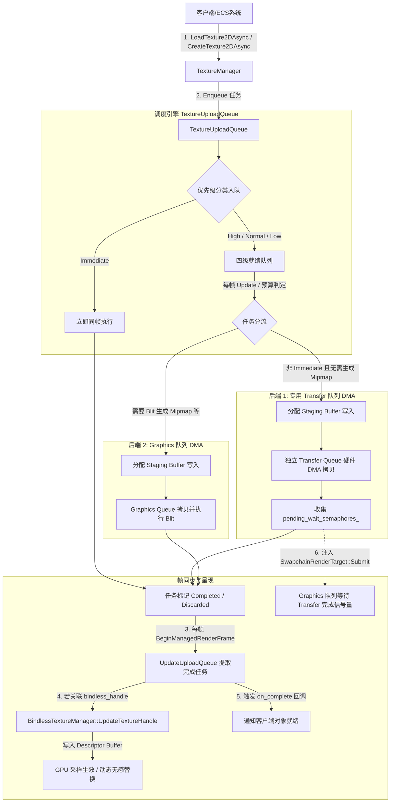

# 统一异步纹理上传系统与 Bindless 集成技术设计与使用指南

> 文档状态：2026-09-23 定稿。本系统为自研引擎构建了统一的纹理上传与调度基础设施，全面采用 GPU 独立专用 Transfer 队列 DMA 纯硬件搬运架构，弃用 CPU 模拟排布的 HostImageCopy，提供 4 级优先级调度、Staging 显存背压控制、任务撤销与退避，并与 `VK_EXT_descriptor_buffer` Bindless 体系实现了原子槽位热更新。

---

## 1. 架构目标与设计原则

在现代基于 GPU-Driven 与 Bindless 架构的游戏引擎中，传统的同步主线程纹理上传（在主渲染队列录制 `vkCmdCopyBufferToImage` 并同步 `vkQueueWaitIdle`）存在三大核心痛点：
1. **帧率卡顿严重**：大纹理（4K、HDR 环境图）解压与传输容易造成明显的掉帧（Frame Drop）。
2. **缺乏多任务权重调度**：UI / 核心角色贴图与背景远景、草地贴图争夺传输带宽，无法保证视觉关键资源的优先呈现。
3. **描述符集与绑定位冲突**：在完全弃用传统 Descriptor Pool、迁移至 `VK_EXT_descriptor_buffer` 的架构下，异步加载的纹理必须能在完成时无锁地热更新至 GPU 的 Bindless 描述符表中。

基于上述背景，我们设计并落地了统一纹理上传管理器（`TextureUploadQueue` 与 `TextureUploadTask`），核心设计原则包括：
- **纯硬件 DMA 异步传输**：优先选用硬件独立异步传输队列（Transfer Queue Family），由 GPU 硬件 Copy Engine 在搬运时线速完成 Optimal Tiling（Morton/Z-Order）重排，避免 CPU 软件 Swizzle 耗时与 Cache 冲刷。
- **4 级优先级队列调度**：分为 `Immediate`（立即同步直达）、`High`（高优先级可视视锥贴图）、`Normal`（常规材质贴图）、`Low`（远景与后台预加载）。
- **支持动态撤销（Cancellation & Discard）**：未出队任务立即安全销毁；已在 GPU 传输中的任务标记为 `Discarded`，完成时自动释放资源而不触发回调。
- **显存水位背压控制（Backpressure）**：限制在飞 Staging Buffer 总体积（默认 128MB），避免爆发式加载导致 OOM。
- **与 Bindless Descriptor Buffer 原子集成**：支持预分配 `bindless_handle`，纹理准备就绪后直接写入 GPU 描述符缓存，实现着色器无感热切换。

---

## 2. 系统核心架构与数据流

整个纹理上传链路从资产请求、调度执行、硬件提交到 Bindless 呈现的完整流向如下：



---

## 3. 核心接口与数据结构

### 3.1 任务描述符：`TextureUploadTask`
位于 `inc/hgl/graph/module/TextureUploadTask.h`：

```cpp
enum class UploadPriority : uint8_t
{
    Immediate = 0,      // 立即/关键路径（主UI、近身必须材质，立即执行或同步等待）
    High      = 1,      // 高优先级（可视视锥内主贴图、Mip0）
    Normal    = 2,      // 普通优先级（通用材质、次级贴图）
    Low       = 3,      // 低优先级（预加载、远景、环境贴图）
    Count     = 4
};

enum class UploadTaskState : uint8_t
{
    Queued,             // 在队列等待调度
    InFlight,           // 已提交至 GPU 传输
    Completed,          // 上传完成，已就绪
    Cancelled,          // 调度前已被取消
    Discarded           // GPU 执行中被撤销，完成后直接丢弃
};

enum class UploadBackendType : uint8_t
{
    Auto,               // 自动判定
    GpuTransferDma,     // 专用 Transfer 队列 DMA 传输
    GpuGraphicsDma      // Graphics 队列 DMA 传输（用于需 Blit 生成 Mipmap 等）
};

struct TextureUploadTask
{
    uint64_t            task_id          = 0;
    UploadPriority      priority         = UploadPriority::Normal;
    UploadBackendType   backend          = UploadBackendType::Auto;
    UploadTaskState     state            = UploadTaskState::Queued;

    Texture *           target_texture   = nullptr;
    TextureCreateInfo * tci              = nullptr;

    DeviceBuffer *      staging_buffer   = nullptr;
    VkDeviceSize        staging_bytes    = 0;

    Semaphore *         transfer_sem     = nullptr;
    VkSemaphore         signal_semaphore = VK_NULL_HANDLE;
    Fence *             fence            = nullptr;

    uint32_t            bindless_handle  = 0;     // 关联的 Bindless 槽位（1-based）
    bool                auto_mipmaps     = false; // 是否需要 Blit 生成多级渐远

    void (*on_complete)(TextureUploadTask *, void *) = nullptr;
    void *              user_data        = nullptr;
};
```

### 3.2 调度管理器：`TextureUploadQueue`
位于 `inc/hgl/graph/module/TextureUploadQueue.h`：

- **显存配额管理**：`max_staging_bytes_` 控制并发的 Staging Buffer 占用上限（默认 128MB）。
- **任务分级与轮询**：每帧调用 `Update()` 时，优先耗尽 `High` 队列配额，再依次调度 `Normal` 与 `Low`。
- **跨队列同步跟踪**：`GetPendingWaitSemaphores()` 收集 DMA 传输的完成信号量，由主渲染管线在 Swapchain Submit 时统一接入等待，避免管线竞争。
- **任务撤销接口**：`CancelUpload(uint64_t task_id)` 支持在调度前（`Cancelled`）或执行中（`Discarded`）进行撤回。

---

## 4. 关键技术设计与硬件架构决策

### 4.1 全面弃用 Host Image Copy（HIC）的技术原因
在系统演进与深入硬件体系结构剖析后，引擎全面移除了 `VK_EXT_host_image_copy`（HIC）路径，决策原因如下：

1. **GPU 硬件 Tiler vs CPU 软件 Swizzling 差距极大**：
   - GPU 显存中的最优排布（Optimal Tiling）通常为 Morton / Z-Order 瓦片化曲线。
   - **GPU 专用 DMA 引擎（Copy Engine / SDMA）**：拥有专用硅片硬件转排电路，在线速数据搬运的同时瞬间完成瓦片化重排，完全不耗费 CPU 算力与 3D 渲染管线。
   - **CPU 软件 Swizzling（HIC 缺陷）**：驱动在调用 `vkCopyMemoryToImageEXT` 时，由 CPU 核心在用户空间运行复杂嵌套循环计算瓦片坐标并逐像素拷贝。对大图（2K/4K 等），单核 CPU 将被吃满 5~15ms 造成剧烈掉帧，且会将 CPU L1/L2/L3 缓存洗刷殆尽（Cache Thrashing）。
2. **驱动实现布局受限**：
   - 在主流驱动（如 Intel Arc）中，`pCopyDstLayouts` 仅允许 `VK_IMAGE_LAYOUT_GENERAL` 布局。若要让采样器在 `VK_IMAGE_LAYOUT_SHADER_READ_ONLY_OPTIMAL` 下工作，仍须插入 GPU 队列管线屏障，丧失了纯 Host 操作的独立性。
3. **架构统一性**：
   - 移除 HIC 后，全平台（独立显卡、核芯显卡、Apple M / AMD UMA）统一采用纯 GPU DMA 传输，代码分支减少，驱动兼容性与稳定性达到最优。

### 4.2 专用 Transfer 队列并发共享（Concurrent Sharing Mode）
引擎全面基于异步 Transfer DMA 传输路径：
- **并发图像创建**：创建 `VkImage` 时传入 `graphics_family` 与 `transfer_family` 两个索引，配置 `VK_SHARING_MODE_CONCURRENT`。
- **免除队列所有权屏障**：无需在 Transfer 队列与 Graphics 队列之间插入复杂的 `release`/`acquire` 屏障。
- **跨队列同步**：Transfer 队列在提交 `vkQueueSubmit2` 时点亮 `task->signal_semaphore`，该信号量被 `TextureUploadQueue` 收集，并注入主渲染帧的 `SwapchainRenderTarget::Submit` 的等待列表，在 `FRAGMENT_SHADER_BIT` 阶段阻塞主管线直到传输完毕。

### 4.3 `VK_EXT_descriptor_buffer` 热更新联动机制
旧版 Vulkan 依赖 `vkUpdateDescriptorSets` 写入描述符池，多线程下存在锁争用和池耗尽风险。本引擎完全基于 `VK_EXT_descriptor_buffer`：
1. **预占槽位渲染**：客户端可通过 `BindlessTextureManager::AllocateHandle` 预分配句柄并绑定极小尺寸的占位纹理（如 32×32 纯色），网格即可提交渲染。
2. **异步后台上传**：通过 `LoadTexture2DAsync` 将真实高分辨率贴图入队，并传递预分配的 `bindless_handle`。
3. **完成时原子写入**：当上传队列在 `ECSContext::BeginManagedRenderFrame` 中轮询到任务就绪，调用 `BindlessTextureManager::UpdateTextureHandle`：
   - 计算目标句柄在显存 Descriptor Buffer 中的物理偏移：`offset = sampled_image_offset + (handle - 1) * sampled_image_size`。
   - 使用 `vkGetDescriptorEXT` 获取最新 `VkDescriptorImageInfo` 的原生硬件描述符数据。
   - 直接 `memcpy` 到映射的显存指针中。
   - 整个过程无需重新绑定描述符集，着色器在下一 draw call 直接采样到高清新贴图。

---

## 5. 开发者使用指南

### 5.1 异步加载纹理并动态绑定

在应用层或 ECS 组件中，使用 `TextureManager` 的异步接口加载纹理：

```cpp
#include <hgl/graph/module/TextureManager.h>
#include <hgl/vk/VKBindlessTextureManager.h>
#include <hgl/log/Log.h>

// 1. 预分配 Bindless Handle 并设置占位纹理
auto *tex_manager = GetManager<TextureManager>();
auto *gc = GetGraphicsContext();
auto *bindless_mgr = gc->GetBindlessTextureManager();

Texture2D *placeholder = tex_manager->LoadTexture2D(OS_TEXT("res/image/Lena32.Tex2D"), false);
uint32_t bindless_handle = bindless_mgr->AllocateHandle(placeholder);

// 2. 异步请求加载高清纹理（指定 High 优先级与目标 Bindless Handle）
auto OnTextureLoaded = [](TextureUploadTask *task, void *user_data)
{
    GLogInfo(u8"Texture task %llu finished!", task->task_id);
    // 可在此处通知材质更新、UI 状态机等
};

uint64_t task_id = tex_manager->LoadTexture2DAsync(
    OS_TEXT("res/image/Character_Diffuse.Tex2D"),
    false,                         // auto_mipmaps
    UploadPriority::High,          // 优先级
    bindless_handle,               // 完成后自动写入该 Bindless 槽位
    OnTextureLoaded,               // 完成回调
    nullptr                        // user_data
);

// 3. 将预分配的 bindless_handle 应用于材质/图元组件，立即可画
primitive_comp->SetMaterialTextureResource("base_color", placeholder, sampler);
```

### 5.2 任务状态查询与取消

```cpp
// 查询当前上传任务状态
UploadTaskState state = tex_manager->GetUploadState(task_id);
if (state == UploadTaskState::Queued)
{
    // 如果玩家转动视角离开该区域，可直接撤销未开始的任务
    bool ok = tex_manager->CancelUpload(task_id);
    if (ok)
    {
        GLogInfo(u8"Task %llu successfully cancelled.", task_id);
    }
}
```

### 5.3 优先级划分规范

| 优先级 | 适用场景 | 调度特性 |
|---|---|---|
| `UploadPriority::Immediate` | 启动关卡核心贴图、主界面UI必用材质 | 同步主线程直达执行，立即就绪 |
| `UploadPriority::High` | 当前视锥体内的重点主角贴图、物理交互关键材质 | 每帧优先调度，不限单帧并发 |
| `UploadPriority::Normal` | 场景通用物件贴图、次级法线图 | 顺序调度，受 Staging 显存背压控制 |
| `UploadPriority::Low` | 远景装饰贴图、后台环境图预热 | 低频调度，在飞 Staging 显存接近预算时主动推迟 |

### 5.4 UMA（集显/APU）与零拷贝直接接管优化

针对 Intel Core Ultra / AMD Ryzen APU / Apple Silicon 等统一内存架构（UMA），引擎执行了特定的数据链路穿透优化：
1. **磁盘流直通零拷贝接管**：
   从文件加载（`LoadTexture2DAsync`）时，`VKTextureLoader` 已经通过流式文件读取将像素直写入 `tci->buffer`（CPU 映射的 `DeviceBuffer`）。上传调度器通过所有权直接接管该缓冲作为 DMA 源，**消除了额外的 StagingBuffer 分配与 CPU 端的冗余 `memcpy`**（CPU 内存复制次数降为 0）。
2. **纯传输缓冲 CPUVisible / Host-Cached 属性映射**：
   对于所有具有 `VK_BUFFER_USAGE_TRANSFER_SRC_BIT` 且无 DST 属性的传输源缓冲，底层内存分配器自动解析为 `BufferAllocPolicy::CPUVisible`，集显环境下优先匹配 `HOST_CACHED` 属性，充分利用 CPU 的 L1/L2/L3 缓存提升文件 IO 吞吐。
3. **GPU 硬件重排替代 CPU Swizzle**：
   虽然 CPU 与 GPU 共享物理内存，但 GPU 纹理采样依赖二维瓦片排布（Optimal Tiling）。通过 GPU 硬件的 Transfer Copy Engine 进行转排，不仅转换速度比 CPU 快数十倍，而且将瓦片化期间的 CPU 占用率降至 0。

---

## 6. 验证与测试用例

引擎提供了完整的集成范例：`example/Texture/AsyncTextureUpload.cpp`，涵盖以下完整场景的自动化测试：
1. **Immediate 优先级**：验证同步直达上传路径。
2. **High 优先级 + Bindless 热更新**：验证高优先级任务完成后，Descriptor Buffer 的原子覆盖与几何体贴图无感切换。
3. **Normal / Low 优先级**：验证基于多优先级的队列调度顺序与 Mipmap 完整性。
4. **运行时任务撤销**：入队后立即触发 `CancelUpload`，验证状态机转换为 `Cancelled/Discarded`，确保无内存泄漏、无野指针悬挂。
5. **Vulkan 验证层合规性**：经 LunarG Validation Layer 实测，全生命周期保持 **0 Validation Errors**。
