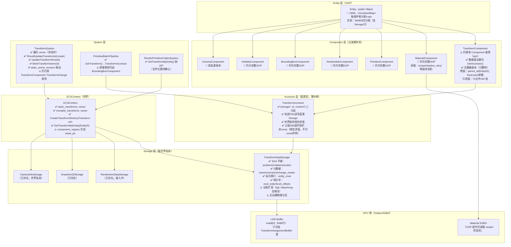
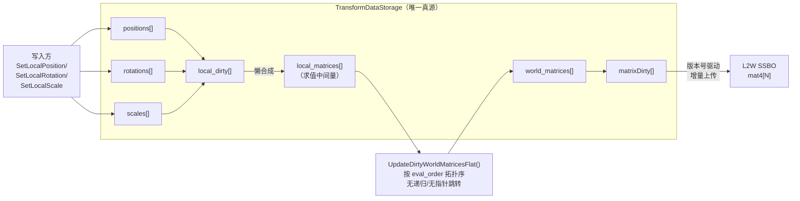
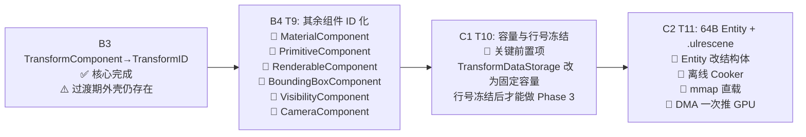

# ULRE 引擎现状架构技术分析报告

> **生成日期**：2026-09-30  
> **代码基线**：commit `b941570` (HEAD)  
> **文档基线**：`doc/future/` 全部 6 份文档  
> **用途**：技术评审 / 宏观设计决策

---

## 一、执行摘要

ULRE 正处于从**传统 OOP-ECS 向扁平 ID+Accessor 架构**的关键过渡期。过去 24 小时的密集提交完成了 **Phase 1（Transform 体系 ID 化）的核心实现**，但整体仍处于"旧壳未脱、新核已立"的过渡状态。距离原始路线图的终态（64B Entity + 二进制场景直载）还有**两个大阶段**的工作量。

| 阶段 | 状态 | 进度 |
|------|------|------|
| Phase 0：GLTF TRS 规范化 | ✅ **已完成** | A1-B1 全部落地 |
| Phase 1：Transform ID + Accessor | ✅ **核心完成** | 存储层/访问器/系统层/渲染层全部接入 |
| Phase 2：全子系统 Component ID 化 | 🔲 **未开始** | `TransformComponent` 仍为过渡期外壳 |
| Phase 3：64B Entity + 二进制直载 | 🔲 **未开始** | 前置项（容量冻结）尚未满足 |

**关键风险**：`TransformComponent` 仍作为"过渡期外壳"存在，与 TransformAccessor 形成**双轨并存**；全仓 347 处引用（75 文件）是下一阶段最大的迁移体量。

---

## 二、架构现状层次图



---

## 三、Transform 体系详细分析（Phase 1 完成态）

### 3.1 数据流向（已实现）



### 3.2 TransformAccessor 设计审计

```cpp
// 实现（TransformAccessor.h）
class TransformAccessor {
    TransformDataStorage *storage = nullptr;  // 8B
    TransformID           id      = INVALID_TRANSFORM_ID;  // 4B
    ECSContext           *context = nullptr;  // 8B（可选，纯数据操作时为空）
};
// 总大小：24B（值类型，栈分配，可随意拷贝）
```

**优点**：
- 零副本：所有读写直落 Storage，不持有数据
- 携带世界上下文（符合 D3 决策：禁用全局 `g_CurrentTransformStorage`）
- 父链遍历有 256 层环保护
- `GetWorldMatrix()`/`GetWorldPosition()` 是非 const（明确"惰性求值"语义）

**潜在问题**：
- 大小 24B（路线图规划为 4B 纯 ID），超出"单寄存器传递"的理想目标
  - 根因：Accessor 必须携带世界上下文，否则违反多世界安全
  - 结论：这是正确的权衡，但文档中"零成本 4 字节"的目标需修订
- 世界旋转/缩放的父链组合走了**独立遍历**（非利用已有的 eval_order），高频调用有冗余开销

### 3.3 TransformDataStorage 审计

| 字段 | 实现方式 | 状态 | 备注 |
|------|---------|------|------|
| positions/rotations/scales | `hgl::ValueArray<glm::vec3/quat>` SOA | ✅ | glm::vec3 因对齐实为 16B |
| local_matrices | `ValueArray<glm::mat4>` | ✅ | 求值中间量，有明确注释 |
| world_matrices | `ValueArray<glm::mat4>` | ✅ | 64B/行，与 GPU Layout 一致 |
| parent_indices | `ValueArray<HandleID>` | ✅ | |
| eval_order / level_offsets | 拓扑序列 | ✅ | 支持未来 ComputeShader |
| owners | `ValueArray<EntityID>` | ✅ T8 | 实体→行真源 |
| entity_rows | `unordered_map<EntityID,HandleID>` | ✅ T8 | 反向索引 O(1) |
| change_masks / versions | `ValueArray<uint32/uint64>` | ✅ T8 | D4 版本号驱动 |
| write_armed / write_warned | `ValueArray<uint8>` | ✅ T8 | 静态写入诊断 |
| children | `vector<vector<HandleID>>` | ✅ | CPU 侧层级查询 |

**关键缺陷**：
- **动态扩容**：`Allocate()` 调用 `ValueArray::Add()` 触发自增长，`TransformAssignmentBuffer` 有"L2W recreated"警告路径 → 行号漂移 → **Phase 3 二进制直载的最大前置阻塞**
- **无动静物理分区**：`static_transforms`/`movable_transforms` 只是 ID 列表，在 Storage 内存上没有 `[0, static_count)` 的物理连续保证
- **`local_matrices` 是 mat4（64B）**：规划文档提到未来改 `Matrix4x3f`（48B）节省 16B，但 D2 决策已拍板"不改"

---

## 四、关键量化数据（实测基线）

> 来源：`ProbeTransformDiagnostics.exe`（2026-09-29 运行）

| 指标 | 实测值 | 备注 |
|------|--------|------|
| `sizeof(Component)` 基类 | **104 B** | vptr + string + version/change_mask |
| `sizeof(TransformComponent)` | **336 B** | 含 storageHandle/bound_storage/parent_id/fixed-pixel 参数 |
| `sizeof(Entity)` | 160 B | Object + UnorderedMap |
| `sizeof(TransformDataStorage)` | 488 B | 含所有 ValueArray 元数据 |
| TransformDataStorage 每行 | **189 B** | positions16+rot16+scale16+local_mat64+parent4+world_mat64+9个辅助 |
| 单 transform 实体总内存（边际） | **939.9 B / 9 次堆分配** | Entity+组件+map节点+Storage行+控制块等 |
| 文档声称的原始大小 | 120~160 B | **低估 6 倍** |
| `TransformComponent` 全仓引用 | **75 文件 / 347 处** | `AddComponent`：74处；`GetComponent`：24处 |
| 影响的 example | 30+ 文件 | Basic/Env/Geo/Gizmo/Texture... |

**Phase 3 收益预期**（达到目标态后）：

| 指标 | 现态 | 目标态 |
|------|------|--------|
| 实体内存 | 940 B / 9 次分配 | **~64 B / 0 分配**（mmap 直载） |
| Transform 行内存 | 189 B（含两份 mat4） | **48 B TRS**（CPU 存储） + 64B L2W（GPU） |
| 场景加载 | 解析+构建 | **mmap 直载 < 10ms** |

---

## 五、现有技术决策审计（D1~D6）

| 决策编号 | 内容 | 拍板结果 | 现状符合度 |
|----------|------|----------|-----------|
| D1 | GPU 侧不引入 48B TransformTRS SSBO | ✅ 不上 | ✅ GPU 侧仍为 mat4 |
| D2 | L2W 不改 mat4→Matrix4x3f | ✅ 不改 | ✅ 未动 |
| D3 | Accessor 不用全局 g_CurrentTransformStorage | ✅ 禁止 | ✅ Accessor 携带 context* |
| D4 | matrixTable 退役（B1） | ✅ 已做 | ✅ B1 完成：TRS-only 导出 |
| D5 | 示例改吃 TRS（B1） | ✅ 优先 | ✅ LoadStaticMesh.cpp 已改 |
| D6 | 真源唯一化（B2） | ✅ 已做 | ✅ 三份副本已删 |

---

## 六、路线图现状 vs 文档规划对照

### 6.1 已完成任务（截至 commit b941570）

| 任务 | 描述 | 关键文件 |
|------|------|---------|
| T0 | 量化探针建立基线 | `ProbeTransformDiagnostics.cpp` |
| T1 | GLTF 死路收敛（子模块） | `GLTFConvert/math/NodeTransform.*` |
| T2 | 负缩放/镜像 3 个 bug 修复 | `CMMath/Matrix4f.cpp`（submodule） |
| T3 | 方向转换配对验证 | `NodeTransform.cpp` M'=R·M·R⁻¹ |
| T4 | 消费侧旋转提取修复 | `LoadScene.cpp` 改 math::DecomposeTransform |
| B1 | matrixTable 退役 + 示例改吃 TRS | `LoadStaticMesh.cpp` |
| B2 | 局部真源唯一化 | `TransformComponent.cpp`（14 个死接口清除） |
| B3.1 | TransformID/Accessor 新增 | `TransformID.h` / `TransformAccessor.h/.cpp` |
| B3.2a | 元数据真源入存储 | `TransformDataStorage.h`（+owners/versions/children 等） |
| B3.2b | Context/System 改走 TransformID | `Context.h/.cpp`、`TransformSystem.cpp` |
| B3.3 | RenderItem 渲染层接入 | `RenderItem.h`、`PrimitiveBatchPipeline.cpp`、`RenderPrimitiveCollectSystem.cpp` |

### 6.2 待完成任务



---

## 七、技术风险与设计问题

### 7.1 高风险（阻塞后续阶段）

#### R1: TransformComponent 过渡期外壳的双轨风险

**现状**：`TransformComponent` 虽已把数据面委托给 `GetAccessor()`，但作为 `Component` 基类的外壳仍存在。每处 `AddComponent<TransformComponent>` 都走老路径（堆分配+map插入），而新的 `CreateTransform(EntityID, Mobility)` API 也已存在。

**风险**：两套路径并存期间，容易出现：
- 某个实体用老路径建组件，`entity_rows` 中没有正确的 owner 映射
- `GetTransformByEntity` 返回无效 accessor（反向索引未建立）

**建议**：在 B3 完成前，用编译器工具追踪 `AddComponent<TransformComponent>` 的所有调用点，制定统一迁移策略。

#### R2: TransformDataStorage 动态扩容导致行号漂移

**现状**：`Allocate()` 调用 `ValueArray::Add()`，存储不预分配。`TransformAssignmentBuffer` 在 `EnsureCapacity` 时会"L2W recreated"（重建 GPU Buffer）。

**风险**：Phase 3 的 mmap 直载要求 `TransformID = L2W 行号`，若容量扩容触发行重建，行号就不稳定，二进制场景文件里固化的 ID 就会失效。

**建议**：T10（容量冻结）必须早于任何 Phase 3 工作。关卡加载时调用 `TransformDataStorage::Initialize(max_statics, max_dynamics)` 预分配。

#### R3: TransformComponent 引用面极大（347 处）

**现状**：全仓 75 文件 347 处引用，`AddComponent` 74 处，分布在 example/ 30+ 文件。

**风险**：B4（其余组件 ID 化）之前必须先把这 347 处改掉，否则每次改 TransformComponent 的头文件都需要重编大量 TU。

**建议**：用脚本生成迁移清单，按模块分批执行（先 example，再 system，再 core）。

### 7.2 中风险（影响设计质量）

#### R4: MaterialComponent 不是纯数据——无法简单"平铺化"

**现状**：`MaterialComponent` 承载了：recipe（材质配方）、`shadow_retry_frames`（阴影重试状态机）、程序解析失败降级逻辑。

**风险**：Phase 2 文档的 `MaterialAccessor` 假设材质是纯 SSBO 数据，但现实中有状态机和运行期逻辑。不能按"纯数据表迁移"处理。

**建议**：`MaterialComponent` 分两层：
1. 数据层（MaterialID → SSBO 行）→ 可以 ID 化
2. 状态层（recipe/重试/降级）→ 保留为 Manager 或专属 System，不入纯数据表

#### R5: BoundingBoxComponent 仍为 OOP，视锥剔除无法向量化

**现状**：`PrimitiveBatchPipeline::PerformFrustumCulling()` 仍通过 `entity->GetComponent<BoundingBoxComponent>()` 做逐实体 OOP 访问。

**影响**：无法 SIMD 向量化，大场景下（1万+实体）有明显的 Cache Miss 压力。

**建议**：`BoundingBoxDataStorage` 已存在头文件，优先完成其实现，将 WorldAABB 数组化，`PrimitiveCullSystem` 改为连续数组批处理。

#### R6: 层级求值的"版本号漏传"风险

**现状**：`MarkDescendantsDirty()` 在 `TransformSystem` 中已修正为"SetDirty + TouchChange(WorldMatrix)"，但若有调用方只调 `SetDirty` 而不 `TouchChange`，子节点的 L2W 行就会漏传给 GPU（版本号未 bump，TransformSystem 认为"已是最新"而跳过）。

**建议**：封装 `MarkDirtyWithPropagation(id)` 工具方法，统一封装 SetDirty+TouchChange，防止未来调用方漏一步。

### 7.3 低风险（需关注的设计债务）

#### R7: ECSContext 头文件过重

**现状**：`Context.h` 691 行，包含 30+ 个头文件（含 vk、graph、ecs 组件头），几乎每个 .cpp 改动都要重编该 include 链。

**建议**：Phase 2 后拆分为 `ContextPublic.h`（纯 API 声明）和 `ContextImpl.h`（内部实现细节），减少编译级联。

#### R8: `eval_order` 构建是 O(n²) 算法

**现状**：`RebuildTopologyOrder()` 使用双重循环（节点×层级），时间复杂度 O(n×max_depth)。对于深层次场景（max_depth 大）会退化。

**建议**：改用 Kahn's Algorithm（BFS 拓扑排序），O(n+e) 复杂度，且自然检测环。

---

## 八、与路线图文档的核心偏差

以下是已通过"Reality Audit"确认的**文档错误**，已在实现层面正确处理：

| 文档主张 | 实际情况 | 处理结果 |
|---------|---------|---------|
| Accessor 只含 4B id | 多世界要求携带 context* | ✅ Accessor 为 24B，携带 {storage*, id, context*} |
| 全局 g_CurrentTransformStorage | 破坏多世界隔离 | ✅ 禁止，已用世界上下文替代（D3） |
| GPU 引入 48B TransformTRS SSBO | 无消费者，增加漂移风险 | ✅ 不引入（D1） |
| 废弃 ActiveRowLease | 错误目标（材质路径，非变换路径） | ✅ 禁止操作（D1 子项） |
| TRS 坐标系转换双重翻转 | 数学错误（对角阵换轴问题） | ✅ 已修正为 M'=R·M·R⁻¹ |
| fastgltf DecomposeNodeMatrices | 镜像有损（无 det<0 分支） | ✅ 已关闭，改为引擎侧感知分解 |
| 动静物理分区（存储层） | 行空间分区已有，存储层未分区 | ⚠️ 待 T10 实现 |

---

## 九、后续优先级建议

### 近期（P0，阻塞性）

1. **完成 TransformComponent 外壳的最终移除**（B3 收尾）
   - 统计所有 `AddComponent<TransformComponent>` 调用点
   - 制定"CreateTransform → entity.SetTransformID"迁移策略
   - 编译器层面禁止旧路径

2. **T10 容量冻结**（Phase 3 的强前置项）
   - `TransformDataStorage` 增加 `Initialize(uint32_t max_statics, uint32_t max_dynamics)`
   - `Allocate()` 在超出容量时 `assert(false)` 而非自增
   - `TransformAssignmentBuffer` 去掉"L2W recreated"路径

### 中期（P1，Phase 2 主线）

3. **BoundingBoxDataStorage 连续化**（高性价比）
   - 先于其余组件 ID 化，因为视锥剔除是热路径
   - `PrimitiveCullSystem` 改为连续数组批处理

4. **MaterialComponent 分层**
   - 剥离纯数据（MaterialID → SSBO 行号）
   - 状态机/recipe 迁移到 MaterialManager

5. **PrimitiveComponent / RenderableComponent ID 化**
   - 配合 GeometryDescriptor + GeometryAccessor

### 远期（P2，Phase 3 收敛）

6. **64B Entity 结构**（依赖所有组件 ID 化完成）
7. **离线 Cooker + .ulrescene 格式**
8. **mmap 直载 + DMA 一次推 GPU**

---

## 十、架构健康度评估

| 维度 | 评分 | 说明 |
|------|------|------|
| 数据真源唯一性 | ⭐⭐⭐⭐☆ | Transform 已唯一，其余组件仍是多真源 |
| 内存效率 | ⭐⭐☆☆☆ | 940B/实体，目标 64B，差距 15x |
| Cache 友好性 | ⭐⭐⭐☆☆ | Transform SOA 良好，其余组件仍散列堆分配 |
| 可扩展性 | ⭐⭐⭐⭐☆ | ID+Accessor 范式设计完整，可推广 |
| 代码质量 | ⭐⭐⭐⭐☆ | 注释详尽，设计决策文档化 |
| 测试覆盖 | ⭐⭐⭐☆☆ | Transform/RenderItem 有测试，其余组件较少 |
| 迁移风险 | ⚠️ 中高 | 347 处引用，双轨并存期易出 bug |

---

> **报告生成者**：Antigravity AI（Claude Sonnet）  
> **数据来源**：代码实测 + 6 份架构文档 + git log 24h 分析
