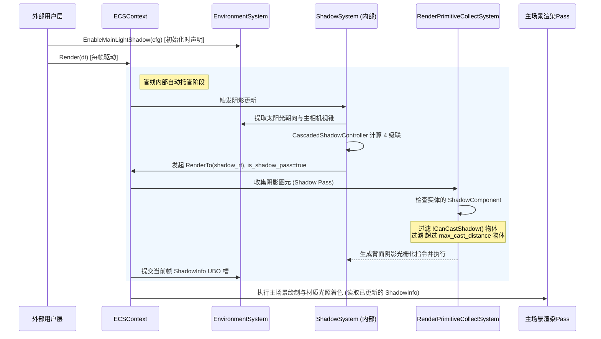

# 场景级全自动阴影管线与 ShadowComponent 解耦设计方案

> 文档状态：设计规范 / 演进路线  
> 核心目标：将阴影管线从“应用层手动编排”转变为“场景级自动化托管”；将阴影属性从“渲染基类平铺”解耦为“独立 ShadowComponent 挂接”。

---

## 一、 核心设计思想

### 1. 场景/环境级意图声明（与太阳光同源）
* 阴影系统本质上是方向光（太阳光）的环境衍生特征。
* 全局配置（如主光是否开启阴影、级联分割距离、全局最大阴影距离、深度 RT 资源）统一由 **`EnvironmentSystem`**（与 `SkyInfo` 同级）托管。
* 离屏 RT 阵列由引擎内部向 `RenderTargetManager` 自动申请与回收，应用层无需在外部维护 `cascade_rts` 句柄数组。

### 2. 实体级正交解耦（ShadowComponent 挂接）
* 实体是否投影、是否受影、单体投影距离等属性，不平铺进通用渲染基类（避免 `RenderableComponent` 退化为膨胀的上帝基类）。
* 以独立的 **`ShadowComponent`** 挂载于拥有 `RenderableComponent` 的 Entity 上，职责清晰正交。
* **缺省回退约定（Convention over Configuration）**：
  * **未显式挂载 `ShadowComponent`**：系统视为**标准默认行为**（`cast_shadow = true`, `receive_shadow = true`, 距离跟随场景全局）。普通实体零编码负担。
  * **显式挂载 `ShadowComponent`**：表达**特异化控制**（例如地面关闭投影、特殊特效物件只在 20m 内投阴、标记物关闭受影等）。

### 3. 渲染管线内部自动闭环（零侵入）
* 阴影 Pass 的生成、相机解算、背面光栅化调度以及 CSM 增量更新由 ECS 管线自动处理。
* 应用层主循环只需调用 `world->Render(dt)`，无需编写任何 `RenderCSM()` 或手动切换 `ground->SetVisible(false)`。

---

## 二、 架构三层职责划分

```
┌────────────────────────────────────────────────────────────────────────┐
│ 1. 场景 / 环境层 (EnvironmentSystem / EnvironmentManager)              │
│    - 与 SkyInfo 太阳光天然绑定                                          │
│    - 管理全局：EnableMainLightShadow(CascadedShadowConfig)             │
│    - 托管 CSM 离屏 RT 阵列生命周期与 ShadowInfo UBO 物化/分槽           │
└───────────────────────────────────┬────────────────────────────────────┘
                                    │ 自动调度驱动
┌───────────────────────────────────▼────────────────────────────────────┐
│ 2. 管线 / 调度层 (ShadowSystem / RenderPrimitiveCollectSystem)         │
│    - 自动在主 Pass 前插入阴影 Pass (is_shadow_pass = true)             │
│    - 自动设置 CullMode::Front 进行背面光栅化                           │
│    - 收集图元时：读取实体的 ShadowComponent 进行距离与开关剔除        │
└───────────────────────────────────┬────────────────────────────────────┘
                                    │ 属性声明
┌───────────────────────────────────▼────────────────────────────────────┐
│ 3. 实体 / 组件层 (Entity + ShadowComponent)                            │
│    - Entity 挂载 ShadowComponent:                                      │
│        * bool  cast_shadow                                             │
│        * float max_cast_distance                                       │
│        * bool  receive_shadow                                          │
│    - 实体不感知底层级联、RT 或光照矩阵，仅声明自身几何阴影意图        │
└────────────────────────────────────────────────────────────────────────┘
```

---

## 三、 数据结构详细设计

### 1. 独立组件：`ShadowComponent`

```cpp
// inc/hgl/ecs/components/ShadowComponent.h
#pragma once

#include <hgl/ecs/core/Component.h>
#include <glm/glm.hpp>

namespace hgl::ecs
{
    /**
     * ShadowComponent - 实体阴影属性控制组件
     * 挂载在拥有 RenderableComponent 的 Entity 上。
     * 若实体未挂载本组件，管线一律采用全局默认规则（投射且接收）。
     */
    class ShadowComponent : public Component
    {
    public:
        // ── 投射控制 (Caster) ──
        bool  cast_shadow        = true;   ///< 是否投射阴影（默认开启）
        float max_cast_distance  = 0.0f;   ///< 最大投射距离（米；<= 0.0f 代表不限/使用场景全局级联）

        // ── 接收控制 (Receiver) ──
        bool  receive_shadow     = true;   ///< 是否接收阴影

        // ── 单体微调扩展 ──
        float bias_multiplier    = 1.0f;   ///< 单体深度偏差缩放系数（防止极薄几何体 acne）

    public:
        explicit ShadowComponent(const std::string &name = "Shadow")
            : Component(name) {}

        // 快捷接口
        bool CanCastShadow() const { return cast_shadow; }
        void SetCastShadow(bool enable) { cast_shadow = enable; }

        bool CanReceiveShadow() const { return receive_shadow; }
        void SetReceiveShadow(bool enable) { receive_shadow = enable; }

        float GetMaxDistance() const { return max_cast_distance; }
        void SetMaxDistance(float dist) { max_cast_distance = dist; }
    };
}
```

### 2. 避免逐帧 `GetComponent` 查找开销（弱指针内部缓存）

在 `RenderableComponent` 中建立单向弱引用，利用组件挂载生命周期自动缓存：

```cpp
class RenderableComponent : public Component
{
    // ... 原有属性 ...
private:
    ShadowComponent *cached_shadow_component = nullptr;

public:
    void SetCachedShadowComponent(ShadowComponent *sc) { cached_shadow_component = sc; }
    ShadowComponent *GetShadowComponent() const { return cached_shadow_component; }

    // 辅助查询：存在组件取组件值，未挂载组件取标准缺省值
    bool CanCastShadow() const
    {
        return cached_shadow_component ? cached_shadow_component->CanCastShadow() : true;
    }

    float GetShadowMaxDistance() const
    {
        return cached_shadow_component ? cached_shadow_component->GetMaxDistance() : 0.0f;
    }

    bool CanReceiveShadow() const
    {
        return cached_shadow_component ? cached_shadow_component->CanReceiveShadow() : true;
    }
};
```

---

## 四、 渲染管线内部执行时序



---

## 五、 用户层 API 对比

### 改造前（手动编码，样板冗余）
```cpp
// 用户层必须手动创建离屏 RT，手动调控制器，手动循环 4 个级联
// 并且为了避免地面自投影，需要手动反复切换地面可见性
void Tick(double dt)
{
    csm_controller.Update(...);
    ground_prim->SetVisible(false); // 侵入式 Hack
    for (uint32_t c = 0; c < 4; ++c) {
        RenderPassRequest req;
        // 填充大量底层参数...
        ecs_context->RenderTo(req);
    }
    ground_prim->SetVisible(true);
}
```

### 改造后（声明式架构，零维护代码）
```cpp
// 1. 场景级初始化：声明太阳光与阴影
auto env = ecs_context->GetSystem<EnvironmentSystem>();
env->SetSkyInfo(...);             // 设置太阳光
env->EnableMainLightShadow();     // 开启阴影托管，引擎内部自动申请 RT、跑控制器

// 2. 实体级特异化声明：挂载 ShadowComponent
auto ground_shadow = ground_entity->AddComponent<ShadowComponent>();
ground_shadow->SetCastShadow(false); // 地面不投射阴影

auto hero_shadow = hero_entity->AddComponent<ShadowComponent>();
hero_shadow->SetMaxDistance(50.0f);  // 角色 50 米外不投射阴影

// 3. 帧主循环：干净整洁
void Tick(double dt)
{
    // 零阴影管线代码，管线内部全自动编排执行！
}
```
